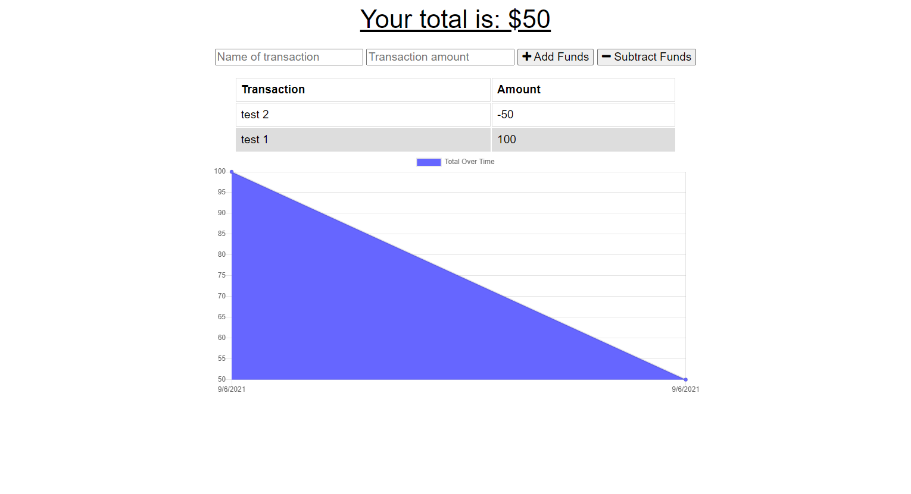

# Budget Tracker

## Description

A simple app to keep track of financial transactions. The app uses MongoDB to store transactions, which must be manually entered by the user. Service workers and IndexedDB provide access while offline.

## Installation

Clone the project from GitHub. Use `npm start` to begin the server from your local machine. Then, visit http://localhost:3001 to begin using the application.

## Deployment

The deployed app is available on Heroku at [https://fathomless-stream-96472.herokuapp.com/](https://fathomless-stream-96472.herokuapp.com/)

## Screenshot

## Contribution

Sam Morgen
